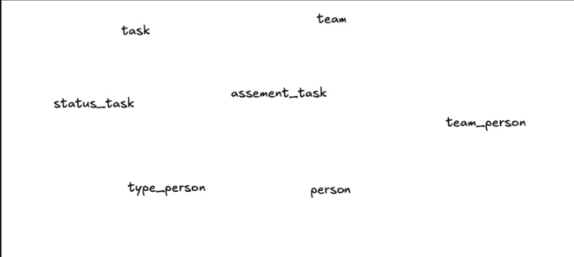
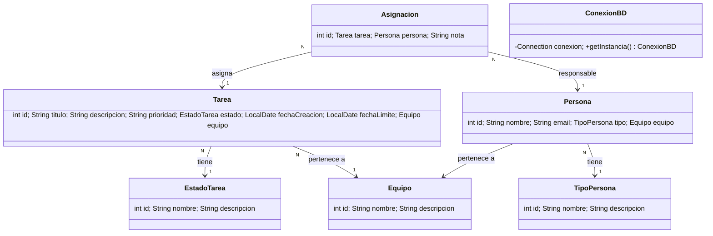
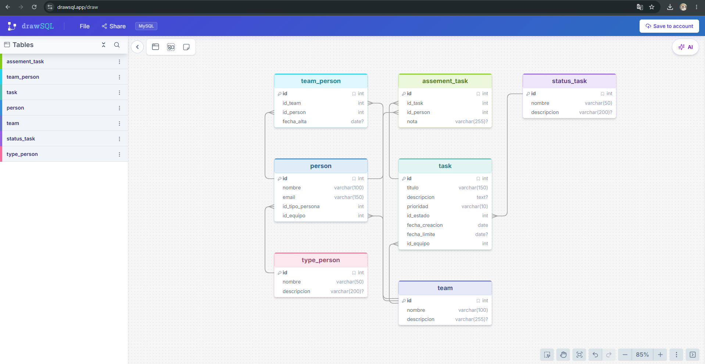

# 📋 Gestor de Tareas — Equipos Scrum (Java Swing + MySQL)

> Proyecto académico. Versión reescrita y ampliada a partir de una base inicial en memoria
> (sin persistencia), ahora conectada a una base de datos **MySQL** real mediante **JDBC**.

---

## 📖 Descripción general

El sistema administra un pequeño "universo" de gestión de tareas para equipos de trabajo ágiles:

- Existen **equipos (`team`)** de trabajo.
- Cada equipo está compuesto por **personas (`person`)**.
- Cada persona tiene un **tipo de persona (`type_person`)**: `Scrum Master`, `Product Owner` o `Developer`.
- Se crean **tareas (`task`)** con **prioridad** (`Alta`, `Media`, `Baja`) y un **estado (`status_task`)**
  (`Por hacer`, `En proceso`, `Finalizada`).
- Las tareas se **asignan a personas** mediante la tabla `assement_task`.
- Un historial de vinculación persona-equipo se guarda en `team_person`.

Esta relación entre entidades es la que se ilustra en el boceto de dominio:



---

## 🧩 Estructura del proyecto

```
GestorTareas/
├── README.md
├── db/
│   └── schema.sql              # Script SQL para crear y poblar la base de datos en MySQL
├── docs/
│   ├── estructura_dominio.png  # Boceto de entidades (imagen de referencia del ejercicio)
│   └── diagrama_drawsql.png    # Captura del modelo ER hecho en drawSQL
└── src/
    ├── Main.java                # Punto de entrada; lanza la ventana Swing
    ├── conexion/
    │   └── ConexionBD.java       # Conexión JDBC a MySQL (patrón Singleton)
    ├── modelo/
    │   ├── Equipo.java
    │   ├── Persona.java
    │   ├── Tarea.java
    │   ├── TipoPersona.java
    │   ├── EstadoTarea.java
    │   └── Asignacion.java
    ├── dao/
    │   ├── EquipoDAO.java
    │   ├── PersonaDAO.java
    │   ├── TareaDAO.java
    │   ├── AsignacionDAO.java
    │   ├── TipoPersonaDAO.java
    │   └── EstadoTareaDAO.java
    └── vista/
        ├── VentanaPrincipal.java   # JFrame con pestañas (JTabbedPane)
        ├── PanelEquipos.java
        ├── PanelPersonas.java
        ├── PanelTareas.java
        ├── PanelAsignaciones.java
        └── PanelDashboard.java
```

---

## 🏗️ Conceptos de programación aplicados

Estos son los temas del curso que se aplicaron en el proyecto (hasta el punto 5.17.5 "Persistencia con
bases de datos"):

| Tema | Dónde se aplica |
|---|---|
| POO (encapsulamiento, clases, objetos) | Todas las clases de `modelo/` |
| Colecciones (`ArrayList`, `List`) | Los DAO devuelven `List<T>` con los resultados de las consultas |
| Manejo de excepciones (`try-catch`, `throws`) | Todos los métodos JDBC de `dao/` propagan `SQLException`; la capa `vista/` la captura y la muestra con `JOptionPane` |
| Patrón de diseño **Singleton** | `ConexionBD` (una sola conexión JDBC compartida por toda la app) |
| Principio de responsabilidad única (SRP) | Separación en capas: `modelo` (datos), `dao` (acceso a datos), `vista` (interfaz) |
| JDBC: `Connection`, `PreparedStatement`, `ResultSet` | Todos los métodos de `dao/` |
| Sentencias SQL: `INSERT`, `SELECT`, `UPDATE` | `EquipoDAO`, `PersonaDAO`, `TareaDAO`, `AsignacionDAO` |
| Interfaz gráfica con Swing (`JFrame`, `JTabbedPane`, `JTable`, `JComboBox`) | Paquete `vista/` |

> Nota: no se implementó absolutamente todo lo visto en el curso (por ejemplo Jackson/JSON o la
> arquitectura hexagonal, que corresponden a temas posteriores al 5.17.5); se aplicó lo que aportaba
> valor real al proyecto, tal como se acordó.

---

## 🗄️ Modelo de base de datos

### Reglas de negocio del dominio

- Una **persona** pertenece a **un tipo de persona** y (opcionalmente) a **un equipo**.
- Un **equipo** puede tener **muchas personas**.
- Una **tarea** pertenece a **un equipo** y tiene **un estado** y **una prioridad**.
- Una **tarea** puede asignarse a **una o varias personas**, y una persona puede tener **varias tareas**
  asignadas → relación **muchos a muchos**, resuelta con la tabla intermedia `assement_task`.
- El historial de qué persona ha pertenecido a qué equipo (y desde cuándo) se guarda en `team_person`
  → también es una relación **muchos a muchos** entre `person` y `team`.

### Diagrama Entidad-Relación (Mermaid)

```mermaid
erDiagram
    TEAM ||--o{ PERSON : "tiene"
    TEAM ||--o{ TASK : "posee"
    TYPE_PERSON ||--o{ PERSON : "clasifica"
    STATUS_TASK ||--o{ TASK : "define estado"
    TEAM ||--o{ TEAM_PERSON : ""
    PERSON ||--o{ TEAM_PERSON : ""
    TASK ||--o{ ASSEMENT_TASK : ""
    PERSON ||--o{ ASSEMENT_TASK : ""

    TEAM {
        int id PK
        varchar nombre
        varchar descripcion
    }
    TYPE_PERSON {
        int id PK
        varchar nombre
        varchar descripcion
    }
    PERSON {
        int id PK
        varchar nombre
        varchar email
        int id_tipo_persona FK
        int id_equipo FK
    }
    STATUS_TASK {
        int id PK
        varchar nombre
        varchar descripcion
    }
    TASK {
        int id PK
        varchar titulo
        text descripcion
        varchar prioridad
        int id_estado FK
        date fecha_creacion
        date fecha_limite
        int id_equipo FK
    }
    TEAM_PERSON {
        int id PK
        int id_team FK
        int id_person FK
        date fecha_alta
    }
    ASSEMENT_TASK {
        int id PK
        int id_task FK
        int id_person FK
        varchar nota
    }
```



### Diagrama de clases (Mermaid)



### Normalización aplicada (hasta 4FN)

1. **1FN (Primera Forma Normal):** todos los atributos son atómicos (por ejemplo, no se guardan
   varias tareas en un mismo campo, ni varios roles en un solo texto); cada tabla tiene una llave
   primaria (`id`).
2. **2FN (Segunda Forma Normal):** como todas las llaves primarias son simples (un solo campo `id`,
   no compuestas), no existen dependencias parciales — se cumple automáticamente.
3. **3FN (Tercera Forma Normal):** se eliminaron dependencias transitivas. Por ejemplo, el **estado**
   de una tarea no se guarda como texto libre dentro de `task`, sino como llave foránea a la tabla
   catálogo `status_task`; lo mismo con el **tipo de persona** (`type_person`). Así, atributos como
   la descripción del estado no dependen indirectamente de la tarea, sino directamente del estado.
4. **4FN (Cuarta Forma Normal):** se eliminaron dependencias multivaluadas independientes. Una
   persona puede pertenecer a varios equipos a lo largo del tiempo y una tarea puede tener varias
   personas asignadas; en vez de mezclar esas dos relaciones multivaluadas dentro de `person` o
   `task`, se separaron en tablas puente independientes: `team_person` (persona ↔ equipo) y
   `assement_task` (tarea ↔ persona). Esto evita anomalías de inserción/eliminación al no
   entrelazar dos hechos independientes en una misma tabla.

### Modelo lógico

Cada entidad del modelo ER se traduce directamente a una tabla relacional (mismo nombre y
atributos que en el diagrama anterior), con llaves foráneas explícitas: `person.id_tipo_persona
→ type_person.id`, `person.id_equipo → team.id`, `task.id_estado → status_task.id`,
`task.id_equipo → team.id`, `team_person.id_team/id_person`, `assement_task.id_task/id_person`.

### Modelo físico (MySQL)

El modelo físico completo (tipos de dato exactos, `AUTO_INCREMENT`, `FOREIGN KEY`, `NOT NULL`, etc.)
está definido en [`db/schema.sql`](db/schema.sql). Es el script que se debe ejecutar en MySQL antes
de correr la aplicación.

### Diagrama generado en drawSQL

Este es el modelo ER final, construido en [drawSQL](https://drawsql.app) siguiendo exactamente las
tablas y relaciones descritas arriba:



---

## ⚙️ Cómo ejecutar el proyecto

### 1. Crear la base de datos

Ejecuta el script `db/schema.sql` en tu servidor MySQL (por ejemplo desde DBeaver: abre el archivo
y ejecútalo completo con `Ctrl+Enter` / "Execute SQL Script"). Esto crea la base `gestor_tareas`,
todas las tablas y los datos de los catálogos (`type_person`, `status_task`).

### 2. Agregar el driver JDBC de MySQL al proyecto

La aplicación necesita el conector **MySQL Connector/J** en el classpath (no viene incluido en el
JDK). En NetBeans: clic derecho sobre el proyecto → *Properties* → *Libraries* → *Add JAR/Folder*
y selecciona el `.jar` del conector (o *Add Library* si ya está registrado en el IDE, como suele
estar en los equipos de Campuslands). Con VS Code + extensión de Java: agrégalo en la carpeta
`lib/` del proyecto y regístralo en `.vscode/settings.json` (`java.project.referencedLibraries`).

### 3. Ajustar los datos de conexión

Abre `src/conexion/ConexionBD.java` y revisa estas 4 constantes al inicio de la clase:

```java
private static final String HOST = "localhost";
private static final String PUERTO = "3306";
private static final String BASE_DATOS = "gestor_tareas";
private static final String USUARIO = "root";
private static final String CLAVE = "root";
```

### 4. Ejecutar

Corre `Main.java`. Se abrirá la ventana con las pestañas **Equipos → Personas → Tareas →
Asignaciones → Dashboard**. El orden recomendado de uso es ese mismo: primero crea un equipo,
luego personas dentro de ese equipo, luego tareas para el equipo, y finalmente asígnalas.

---

## 👤 Autores

Proyecto académico — Filip Sanabria y Camilo García.
